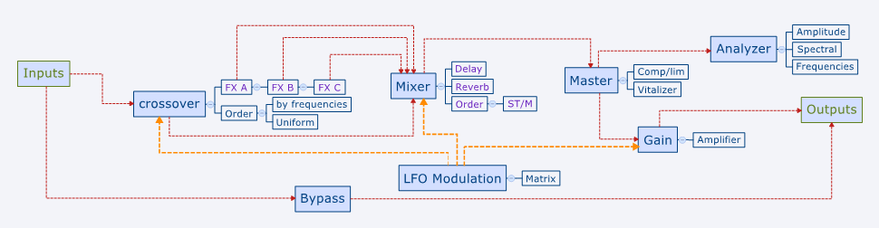

DEsign

---

## Components

* MAIN
* PROCESSOR
* GUI

| File | Description | Type | Weight |
| --- | --- | --- | --- |
| DSPW-processor.h | Main Structure | Header | 5.0ko |
| DSPW-processor.cpp | DSP Operators | Audio Processing | 3.4ko |
| DSPW-editor.h | Main GUI | Header | 5.0ko |
| DSPW-editor.cpp | Visual Structure | User Interface | 3.4ko |

